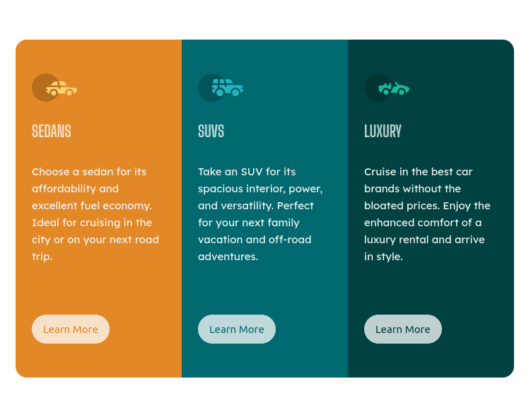

# Frontend Mentor - 3-column preview card component solution

This is a solution to the [3-column preview card component challenge on Frontend Mentor](https://www.frontendmentor.io/challenges/3column-preview-card-component-pH92eAR2-). Frontend Mentor challenges help you improve your coding skills by building realistic projects. 

## Table of contents

- [Overview](#overview)
  - [The challenge](#the-challenge)
  - [Screenshot](#screenshot)
  - [Links](#links)
- [My process](#my-process)
  - [Built with](#built-with)
  - [What I learned](#what-i-learned)
  - [Continued development](#continued-development)
  - [Useful resources](#useful-resources)
- [Author](#author)

## Overview

### The challenge

Users should be able to:

- View the optimal layout depending on their device's screen size
- See hover states for interactive elements

### Screenshot

### Links

- Solution URL: (https://github.com/francobwogo/frontend-mentor-3-column-preview-card-component.git)
- Live Site URL: (https://francobwogo.github.io/frontend-mentor-3-column-preview-card-component/)

## My process

### Built with

- Semantic HTML5 markup
- CSS custom properties
- Flexbox
- Mobile-first workflow

### What I learned

- Building responsive websites with CSS.

### Continued development

- Learn and practise more CSS.

### Useful resources

- Kevin Powell - Responsive design made easy (https://www.youtube.com/watch?v=bn-DQCifeQQ&t=2119s) - This helped me learn responsive web design. Kevin's workflow is easy to learn and use.
- The Odin Project (https://www.theodinproject.com/).

## Author

- Frontend Mentor - [@francobwogo](https://www.frontendmentor.io/profile/francobwogo)
